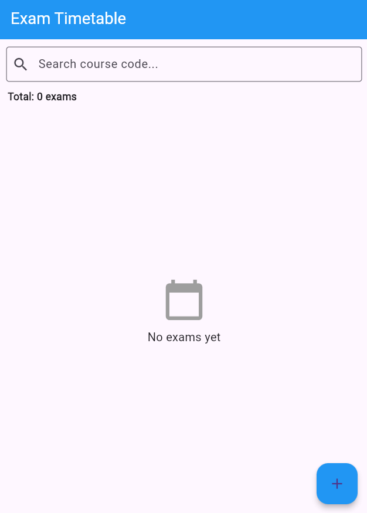
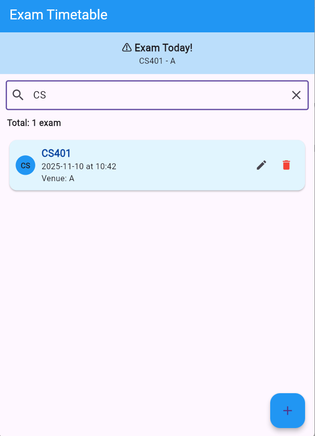
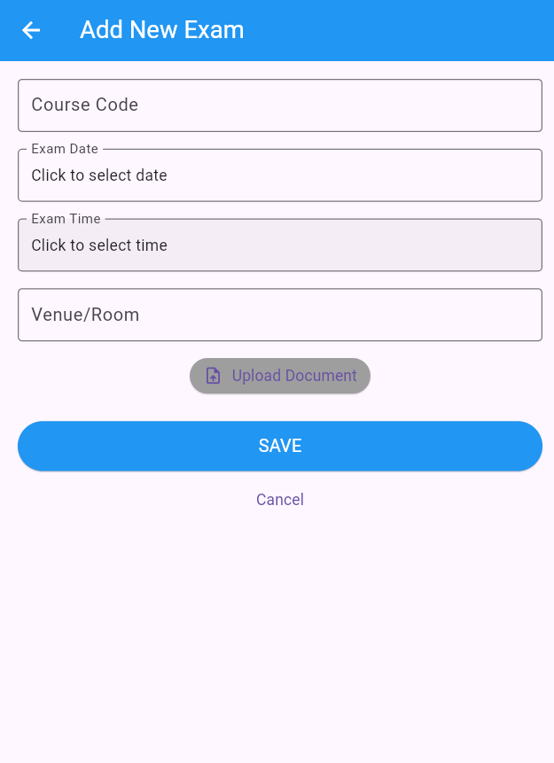
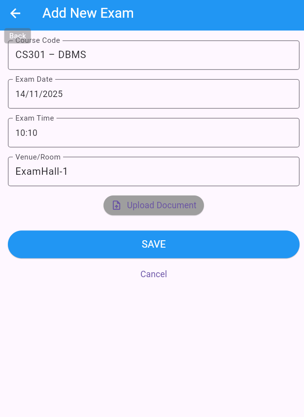
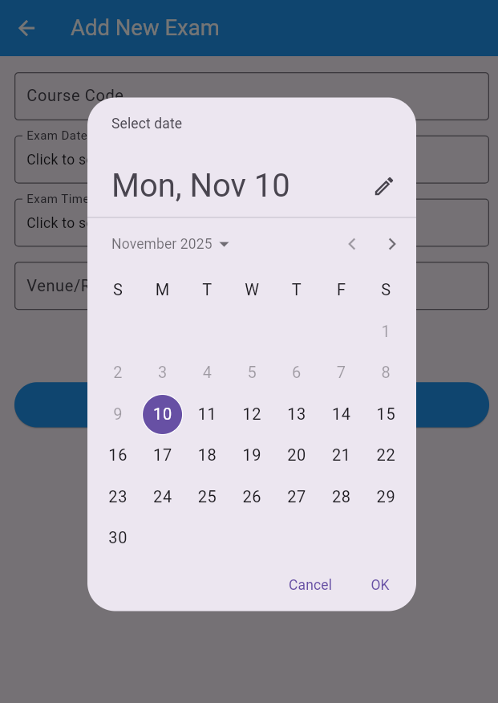
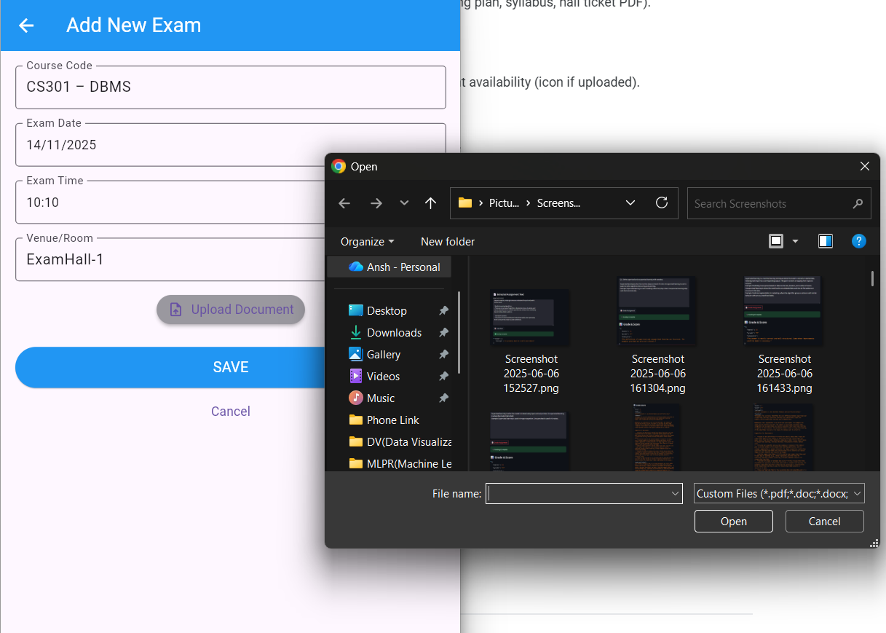
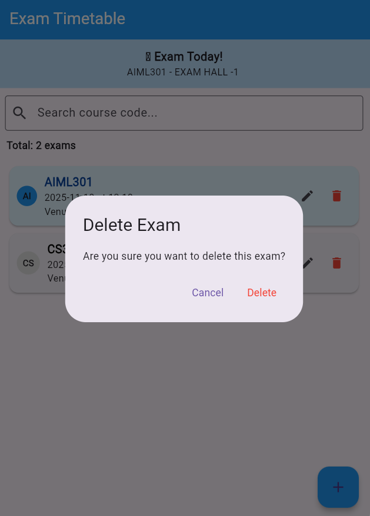
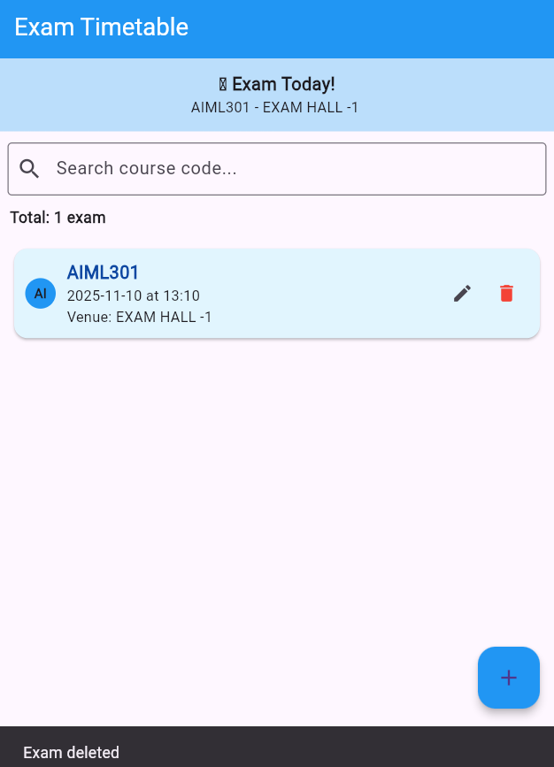

# 📚 Exam Timetable App

A Flutter application to manage and organize your exam schedules efficiently. Keep track of your upcoming exams with course codes, dates, times, venues, and attach relevant documents.

## ✨ Features

- **📋 Exam Management** - Add, edit, and delete exam entries
- **🔍 Search Functionality** - Search exams by course code
- **⏰ Upcoming Exam Alerts** - Visual countdown showing days until your next exam
- **📎 Document Attachment** - Attach PDF, DOC, DOCX, JPG, or PNG files to exams
- **💾 Local Storage** - Data persisted using SharedPreferences
- **🎨 Material Design 3** - Modern and clean UI with Material You design

## 📱 Screenshots

### Home Page
The main screen displays all your scheduled exams in a list format with the upcoming exam highlighted at the top.



### Search Bar
Easily search for specific exams using the course code.



### Add New Exam
Add a new exam by filling in the course code, date, time, venue, and optionally attaching a document.



### Adding Exam Details
Fill in all the required information for your exam.



### Date Picker
Select the exam date using the built-in date picker.



### Time Picker
Choose the exam time using the time picker.


### Upload Document
Attach relevant documents (PDF, DOC, images) to your exam entries.



### Exam Added Successfully
Confirmation when an exam is successfully added.


### Edit Exam
Modify existing exam details.


### Delete Confirmation
Confirmation dialog before deleting an exam.



### Exam Deleted
Confirmation after successfully deleting an exam.



## 🏗️ Project Structure

```
lib/
├── main.dart                 # App entry point
├── database/
│   └── database_helper.dart  # Local storage operations using SharedPreferences
├── models/
│   └── exam.dart             # Exam data model
├── screens/
│   ├── exam_list_screen.dart # Main screen with exam list
│   └── exam_form_screen.dart # Add/Edit exam form
└── widgets/
    └── exam_card.dart        # Reusable exam card widget
```

## 🛠️ Technologies Used

- **Flutter** - Cross-platform UI framework
- **Dart** - Programming language
- **SharedPreferences** - Local data persistence
- **intl** - Date and time formatting
- **file_picker** - Document attachment functionality

## 📦 Dependencies

```yaml
dependencies:
  flutter:
    sdk: flutter
  shared_preferences: ^2.2.2
  intl: ^0.18.1
  file_picker: ^6.0.0
  cupertino_icons: ^1.0.8
```

## 🚀 Getting Started

### Prerequisites

- Flutter SDK (^3.8.1)
- Dart SDK
- Android Studio / VS Code with Flutter extensions

### Installation

1. **Clone the repository**
   ```bash
   git clone <repository-url>
   cd exam_timetable_app
   ```

2. **Install dependencies**
   ```bash
   flutter pub get
   ```

3. **Run the app**
   ```bash
   flutter run
   ```

### Build for Production

```bash
# Android APK
flutter build apk --release

# iOS
flutter build ios --release

# Web
flutter build web --release
```

## 📝 Usage

1. **Add an Exam**: Tap the floating action button (+) to add a new exam
2. **Fill Details**: Enter course code, select date and time, add venue
3. **Attach Document** (Optional): Upload relevant study materials or exam info
4. **Save**: Tap SAVE to add the exam to your timetable
5. **Edit**: Tap the edit icon on any exam card to modify details
6. **Delete**: Tap the delete icon and confirm to remove an exam
7. **Search**: Use the search bar to filter exams by course code

## 🎯 Key Features Explained

### Upcoming Exam Alert
- Displays the nearest upcoming exam at the top of the screen
- Shows countdown in days until the exam
- Special highlighting for exams happening today

### Local Storage
- All exam data is stored locally using SharedPreferences
- Data persists even after closing the app
- No internet connection required

### Document Attachment
- Supports PDF, DOC, DOCX, JPG, and PNG formats
- Visual indicator shows when a document is attached
- Easy removal of attached documents

## 📄 License

This project is open source and available under the [MIT License](LICENSE).

## 🤝 Contributing

Contributions, issues, and feature requests are welcome! Feel free to check the issues page.

---

Made with ❤️ using Flutter
